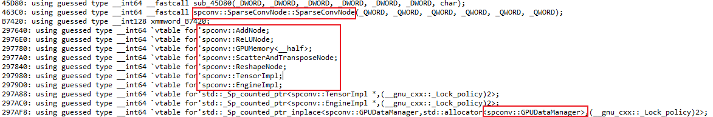

### 1. BEVFusion模型的int8/fp16量化
- ① [使用BEVFusion官方库训练你自己的模型](https://github.com/mit-han-lab/bevfusion)，注意，这个项目是mit-bevfusion,不是阿里和北大合作那个。由于官方的camera的backbone是swint，int8量化有些精度损失，这里使用resnet50替换进行重新训练，这里给出[resnet50配置文件链接](./resnet50_cfg)，如果你想训练，直接替换swint配置文件即可。其测试精度结果如下：
```bash
# map和NDS略差于swint(map:68.52,NDS:71.38)，但也相差不多，结果可以接受
All-Classes results:
mAP: 0.6791
NDS: 0.7097

Per-class results:
Object Class    AP      ATE     ASE     AOE     AVE     AAE
car     0.893   0.169   0.149   0.058   0.275   0.185
truck   0.645   0.322   0.180   0.079   0.246   0.225
bus     0.738   0.345   0.186   0.061   0.450   0.276
trailer 0.429   0.534   0.202   0.593   0.212   0.144
construction_vehicle    0.295   0.711   0.432   0.866   0.115   0.306
pedestrian      0.880   0.134   0.285   0.374   0.216   0.096
motorcycle      0.770   0.183   0.247   0.227   0.357   0.263
bicycle 0.627   0.156   0.254   0.497   0.191   0.015
traffic_cone    0.797   0.122   0.324   nan     nan     nan
barrier 0.717   0.179   0.277   0.053   nan     nan
```
- ② (可跳过) 使用TensorRT官方库自带的量化工具(pytorch-quantization)| [官方链接及安装方式](https://github.com/NVIDIA/TensorRT/tree/release/8.6/tools/pytorch-quantization)| [官方使用文档](https://docs.nvidia.com/deeplearning/tensorrt/pytorch-quantization-toolkit/docs/userguide.html)，建议学习
- ③ (可跳过) 使用 [bevfusion量化小工具(pytorch-quantization版)](../../assets/python_tools/bevfusion_qat)，将其放到bevfusion官方代码的根目录下，按照下面步骤操作即可得到量化后的模型文件：
```bash
# 1. 环境安装
# 1.1 bevfusion环境安装，直接按照上面给的bevfusion官方链接安装自己的环境即可
# 1.2 pytorch-quantization安装，同理，直接安装其官方教程安装即可

# 2. 对自己训练的模型进行精度验证，可跳过，下面只验证3D检测精度，精度结果如上所示：
torchpack dist-run -np 4 python tools/test.py \
    configs/nuscenes/det/transfusion/secfpn/camera+lidar/resnet50_cfg/convfuser.yaml \
    pretrained/bevfusion-resnet50-det.pth \
    --eval bbox

# 3. 对bevfusion-resnet50-det.pth进行int8量化
# 3.1 这一步后我们会得到一个int8量化后的bevfusion_ptq.pth模型
python bevfusion_qat/ptq.py \
    --config=configs/nuscenes/det/transfusion/secfpn/camera+lidar/resnet50_cfg/convfuser.yaml \
    --ckpt=pretrained/bevfusion-resnet50-det.pth \
    --calibrate_batch 300 \
    --save_dir bevfusion_qat/quant_model/ckpt

# 4. 导出所需的onnx模型，由于Lidar模型检测是3DSparseConvolution，tensorrt暂不支持直接推理
#   所以，这里把整个bevfusion模型进行拆分；下面是BEVFusion模型各个部分的int8 onnx的模型导出，其模型结构如下:
  BEVFusion-onnx模型
  |--camera.backbone.onnx # 图像模块的主干网络
  |--camera.vtransform.onnx # 图像转换模块
  |--lidar.backbone.xyz.onnx # 点云处理的主干网络，bevfusion用的是3d稀疏卷积，pulgin方式太慢，这里通过加载nvidia给的第三方库进行推理
  |--fuser.onnx # 融合模块
  |--head.bbox.onnx # 头处理模块
# 4.1 camera部分导出，会导出两个onnx，分别是：camera.backbone.onnx 和 camera.vtransform.onnx
python bevfusion_qat/export/export-camera.py \
    --ckpt bevfusion_qat/quant_model/ckpt/bevfusion_ptq.pth \
    --input_data bevfusion_qat/example-data/example-data.pth \
    --quant_precision int8 \
    --save_dir bevfusion_qat/quant_model

# 4.2 Lidar部分导出，会导出一个 lidar.backbone.xyz.onnx
python bevfusion_qat/export/export-lidar.py \
    --ckpt bevfusion_qat/quant_model/ckpt/bevfusion_ptq.pth \
    --save_onnx_dir bevfusion_qat/quant_model/onnx_int8

# 4.3 两者融合部分的导出，会导出两个onnx文件，fuser.onnx 和 head.bbox.onnx
python bevfusion_qat/export/export-transfuser.py \
    --ckpt bevfusion_qat/quant_model/ckpt/bevfusion_ptq.pth \
    --quant_precision int8 \
    --save_dir bevfusion_qat/quant_model

# 5. 生成engine模型(fp16/int8)，会生成四个engine模型，lidar模型使用onnx直接输入
bash bevfusion_qat/onnx_to_engine.sh
# 生成的engine目录如下所示:
BEVFusion-engine模型
|--camera.backbone.engine
|--camera.vtransform.engine
|--onnx_to_engine.log # 这个是trtexec导出的log文件,可以查看具体的输出内容
|--fuser.engine
|--head.bbox.engine
```
- ④ lidar.backbone.xyz.onnx的3DSparseConvolution使用nvidia提供的算子解析库推理，直接复制到engine目录中即可，后面会用来直接推理
  - 原理：nvidia官方将3D稀疏卷积算子的推理直接封装成了一个动态库，我反编译so文件，发现是直接解析onnx模型，以节点的形式进行推理的。由于tensorrt的编译推理源码未开源，所以只能用他给的库推理
  

### 2. 使用该项目进行trt-int8推理
- ① 根据上面的操作会生成四个engine模型和一个onnx模型
- ② 输入的是六张图片+点云数据+变换矩阵等，我放在了workspaces/res/example-data下
- ③ 使用然后使用本项目直接推理即可
```bash
git checkout bev # 注意，这个是在bev分支上
main_bevfusion_det.cpp # 这个是程序入口，直接编译运行即可
```