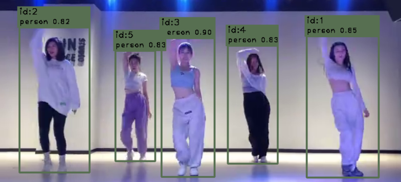

### ByteTrack指标展示
<p align="center"></p>

### ByteTrack in C++
**1. 安装opencv，已经安装过的就略过**
```bash
sudo apt-get install libopencv-dev # 简单安装即可，无需高版本的opencv
```
**2. 安装Eigen-3.3.9，这里面有一些矩阵库我们要使用，安装教程如下**

- 下载链接(约3M)-->[[google]](https://drive.google.com/file/d/1rqO74CYCNrmRAg8Rra0JP3yZtJ-rfket/view?usp=sharing) or [[baidu(code:ueq4)]](https://pan.baidu.com/s/15kEfCxpy-T7tz60msxxExg).
- 安装命令
```shell
unzip eigen-3.3.9.zip
cd eigen-3.3.9
mkdir build
cd build
cmake ..
sudo make install
```
- 然后在CmakeList.txt中添加如下命令即可使用
```shell
find_package(Eigen3 REQUIRED)
include_directories(
    ${EIGEN3_INCLUDE_DIRS}
)
```

### 使用例子
**随便一个检测器，这里以yolov8-det举例**
- 程序入口:mains/main_track_yolov8_det.cpp
```c++
#include "tracker/ByteTracker/byte_tracker.hpp"
#include "tracker/ByteTracker/strack.hpp"

/* 初始化追踪类
     parameter1: 指你传入的视频帧率
     parameter2：你要设置的追踪id最长保存的帧数，不建议太大
*/
ai::ByteTrack::BYTETracker tracker(fps, 30); // 这里最长保留30帧

ai::cvUtil::BoxArray res_boxes = det_obj.forward(ai::cvUtil::cvimg_trans_func(img)); // 任意一个检测器
std::vector<ai::ByteTrack::STrack> output_stracks = tracker.update(res_boxes);// update,追踪结束。

// STrack类里面有box的xmin,ymin,xmax,ymax，score，class_label,track_id等，看例子理解。
```
**追踪效果如下所示：精度和速度都很不错**


